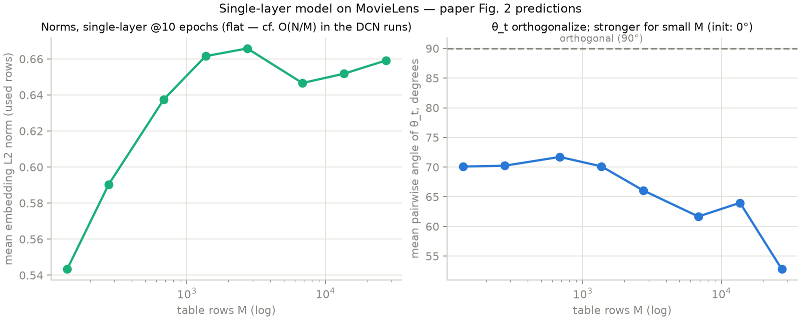
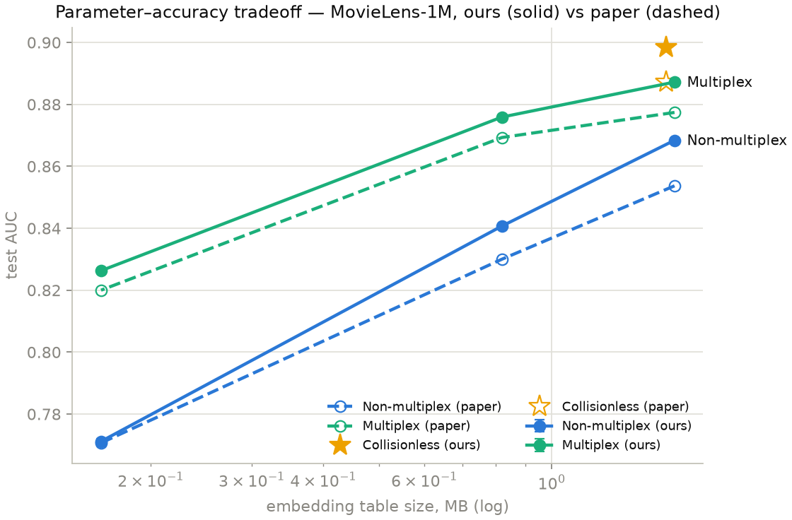
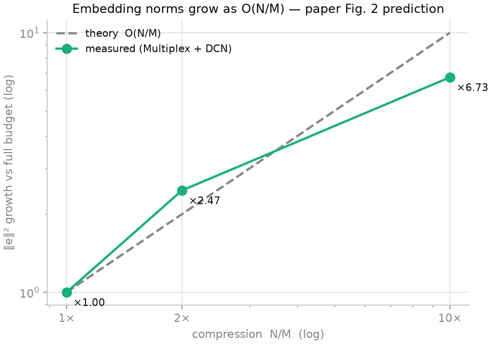

# unified-embeddings

Three categorical embedding strategies — Non-multiplex (per-feature hash
tables, budget split by cardinality), Multiplex (one shared table, per-feature
hash salt), Collisionless (exact vocabulary, upper bound) — replicating
Feature Multiplexing / Unified Embedding (https://arxiv.org/abs/2305.12102)
on CTR ranking, then extended to retrieval: two-tower candidate generation,
SASRec, and featured runs on Yambda / VK-LSVD under Global Temporal Split.
Per-dataset processing and traps: [docs/DATASETS.md](docs/DATASETS.md). Formal
theory for the retrieval losses: [docs/THEORY.md](docs/THEORY.md).

## Layout

```
config.py                dataclass per pipeline (ranking / candgen / candgen_gts / sasrec / orthogonality)
configs/                 <dataset>_<pipeline>[_variant].py — one file = one experiment
embeddings.py            all embedding storage strategies + hashing (prehash)
models.py                networks: DCNV2 / MLP (ranking), TwoTower (candgen), TwoTowerFeat (GTS), SingleLayer
gsasrec.py               SASRec model (vendored from the logq repository)
transformer_decoder.py   SASRec attention blocks (same source)
dataset_utils.py         all data loaders
eval_utils.py            all metrics (evaluate_auc — ranking, eval_split — SASRec, ...)
train_ranking.py         CTR ranking (paper replication)
train_candgen.py         two-tower candidate generation
train_candgen_gts.py     featured two-tower on Yambda / VK-LSVD (temporal split)
train_sasrec.py          SASRec
train_orthogonality.py   Sec. 4.2 orthogonalization experiment
evaluate.py              evaluate a saved checkpoint
prepare_data.py          one-time Avazu / Criteo preparation
report.py / plots.py / tb_export.py    log analysis
experiment_logs/ | checkpoints/ | runs/    JSON logs, checkpoints, TensorBoard
```

## Setup

Python >= 3.10 (tested on 3.12). With [uv](https://docs.astral.sh/uv/):

```
uv venv --python 3.12 .venv
uv pip install --python .venv/bin/python -r requirements.txt
source .venv/bin/activate
```

## Data (one time)

MovieLens-1M:

```
curl -O https://files.grouplens.org/datasets/movielens/ml-1m.zip
unzip ml-1m.zip
```

Avazu and Criteo — raw Kaggle files through the one-time preparation (vocab
pruning to the paper's Tables 4/5, Criteo dense log-normalization, Avazu
hour-of-day):

```
python prepare_data.py criteo --raw train.txt
python prepare_data.py avazu  --raw train.gz
```

Retrieval datasets (Beauty, Steam, Gowalla, Yambda, VK-LSVD) download
themselves into datasets/ on first use.

## Running

Every training script takes a single `--config` argument pointing to a file in
configs/ (one per dataset x arm). Hyperparameters, budgets, method selection,
probes and seeds live in the config file, not in CLI flags; edit or copy a
config to change an experiment. Each run writes a JSON log to experiment_logs/
and the best checkpoint per experiment to checkpoints/.

### Ranking (paper replication)

```
python train_ranking.py --config=configs/ml1m_ranking.py
python train_ranking.py --config=configs/ml1m_ranking.py --dry-run    # table sizes only, no training
bash run_server.sh setup && bash run_server.sh all                    # full Criteo+Avazu on a GPU server
python report.py experiment_logs/<ts>_<dataset>.json                  # table with diff vs paper Table 1
python plots.py  experiment_logs/<ts>_movielens.json                  # tradeoff / norms / curves PNGs
python train_orthogonality.py --config=configs/ml1m_orthogonality.py  # Sec. 4.2 / Fig. 2 experiment
```

### Candidate generation (two-tower)

```
python train_candgen.py --config=configs/ml1m_candgen.py
python train_candgen.py --config=configs/beauty_candgen.py            # also: steam, gowalla, yambda50m
```

### SASRec

```
python train_sasrec.py --config=configs/ml1m_sasrec.py                # method sweep + tied baseline
python train_sasrec.py --config=configs/ml1m_sasrec_tied_cl.py        # tied collisionless, 5 seeds
python train_sasrec.py --config=configs/ml1m_sasrec_2probe_tied.py    # tied Multiplex 2-probe concat, 5 seeds
bash run_sasrec_all.sh                                                # the tied pair on ml1m + beauty + steam
```

### Yambda / VK-LSVD

```
bash run_server_gts.sh setup && bash run_server_gts.sh smoke
bash run_server_gts.sh all
python train_candgen_gts.py --config=configs/yambda50m_gts_multi.py   # also: _likes, _listens
python train_candgen_gts.py --config=configs/vklsvd_gts.py
```

### Evaluating a checkpoint

```
python evaluate.py --config=configs/ml1m_sasrec.py --checkpoint=checkpoints/<name>.pt
```

### TensorBoard

```
tensorboard --logdir runs
python tb_export.py            # convert any experiment_logs/*.json to runs/
```

Tags: `<metric>/<experiment>/b<budget>` (`auc_val` for ranking,
`ndcg10_val` / `ndcg100_val` / `recall100_val` for retrieval); multi-seed
runs are averaged into one curve per method.

## Results — ranking (paper Table 1)

### MovieLens-1M (random 80/10/10 split, 5 runs)

Budgets map to Table 1 columns: 1.0x = 1.6MB, 0.5x = 791kB, 0.1x = 158kB.

| Budget | Experiment | AUC (5 runs) | Paper | Diff |
|---|---|---|---|---|
| 1.0x | Non-multiplex + DCN | 0.8684 ± 0.0005 | 0.8537 | +0.015 |
| 1.0x | Multiplex + DCN     | 0.8872 ± 0.0002 | 0.8774 | +0.010 |
| 1.0x | Collisionless + DCN | 0.8985 ± 0.0004 | 0.8872 | +0.011 |
| 0.5x | Non-multiplex + DCN | 0.8407 ± 0.0004 | 0.8300 | +0.011 |
| 0.5x | Multiplex + DCN     | 0.8759 ± 0.0007 | 0.8693 | +0.007 |
| 0.1x | Non-multiplex + DCN | 0.7712 ± 0.0008 | 0.7707 | +0.000 |
| 0.1x | Multiplex + DCN     | 0.8263 ± 0.0006 | 0.8200 | +0.006 |

MLP arm (ours, single run): Non-multiplex 0.8664 / 0.8387 / 0.7682,
Multiplex 0.8861 / 0.8751 / 0.8264, Collisionless 0.8963.

### Criteo (temporal split, single run)

Budgets map to Table 1 columns: 2.0x = 25MB, 1.0x = 12.5MB, 0.2x = 2.5MB.

| Budget | Experiment | AUC | Paper | Diff |
|---|---|---|---|---|
| 25MB   | Non-multiplex + DCN | 0.8067 | 0.8021 | +0.005 |
| 25MB   | Multiplex + DCN     | 0.8092 | 0.8043 | +0.005 |
| 25MB   | Collisionless + DCN | 0.8095 | 0.8070 | +0.003 |
| 12.5MB | Non-multiplex + DCN | 0.8058 | 0.7998 | +0.006 |
| 12.5MB | Multiplex + DCN     | 0.8090 | 0.8047 | +0.004 |
| 2.5MB  | Non-multiplex + DCN | 0.7989 | 0.7944 | +0.005 |
| 2.5MB  | Multiplex + DCN     | 0.8082 | 0.8049 | +0.003 |

### Avazu (90/10 shuffle split, single run)

Budgets: 10.0x = 32.4MB, 1.0x = 3.24MB, 0.1x = 324kB.

| Budget | Experiment | AUC | Paper | Diff |
|---|---|---|---|---|
| 32.4MB | Non-multiplex + DCN | 0.7748 | 0.7724 | +0.002 |
| 32.4MB | Multiplex + DCN     | 0.7761 | 0.7735 | +0.003 |
| 32.4MB | Collisionless + DCN | 0.7765 | 0.7735 | +0.003 |
| 3.24MB | Non-multiplex + DCN | 0.7679 | 0.7671 | +0.001 |
| 3.24MB | Multiplex + DCN     | 0.7737 | 0.7718 | +0.002 |
| 324kB  | Non-multiplex + DCN | 0.7525 | 0.7510 | +0.002 |
| 324kB  | Multiplex + DCN     | 0.7702 | 0.7686 | +0.002 |

### Weight orthogonalization (Sec. 4.2 / Fig. 2)

Single-layer model, worst-case init (all feature weights aligned); mean
pairwise angle grows 0° → 53° (M=27K) → 70-72° (M≤1.4K) as the table shrinks.








## Results — SASRec (full catalog)

2-probe = two hash lookups per item at identical bytes (concat: double rows at
half width; mean: two full-width rows averaged). Tied = shared input/output
item table (structural 2x compression). Splits: ML-1M, Beauty — leave-one-out;
Yambda — temporal (target = last like of the held-out day); VK-LSVD — weekly
temporal (target = last positive of weeks 25/26).

### MovieLens-1M

2-probe rows: 5 runs (mean ± std), model selection on val NDCG@10; tied
collisionless: single run.

| Memory | Configuration | NDCG@10 | HR@10 |
|---|---|---|---|
| 3.60 MB | Multiplex (2-probe concat) | 0.1706 ± 0.0021 | 0.2907 ± 0.0033 |
| | Multiplex (2-probe mean) | 0.1703 ± 0.0025 | 0.2919 ± 0.0040 |
| 1.85 MB | Collisionless (tied) | 0.1708 | 0.2987 |
| | Multiplex (2-probe mean) | 0.1659 ± 0.0008 | 0.2866 ± 0.0024 |
| | Multiplex (2-probe concat) | 0.1651 ± 0.0019 | 0.2849 ± 0.0037 |
| 0.45 MB | Multiplex (2-probe concat) | 0.1276 ± 0.0046 | 0.2301 ± 0.0078 |
| | Multiplex (2-probe mean) | 0.1027 ± 0.0011 | 0.1742 ± 0.0014 |

### Beauty

5 runs (mean ± std), model selection on val NDCG@100.

| Memory | Configuration | NDCG@10 | HR@10 |
|---|---|---|---|
| 58.69 MB | Multiplex (2-probe concat) | 0.0239 ± 0.0003 | 0.0369 ± 0.0008 |
| | Multiplex (2-probe mean) | 0.0237 ± 0.0003 | 0.0365 ± 0.0005 |
| 29.36 MB | Collisionless (tied) | 0.0291 ± 0.0006 | 0.0488 ± 0.0006 |
| | Multiplex (2-probe concat) | 0.0238 ± 0.0005 | 0.0367 ± 0.0012 |
| | Multiplex (2-probe mean) | 0.0225 ± 0.0006 | 0.0349 ± 0.0007 |
| 5.89 MB | Multiplex (2-probe concat) | 0.0208 ± 0.0004 | 0.0331 ± 0.0009 |
| | Multiplex (2-probe mean) | 0.0185 ± 0.0003 | 0.0284 ± 0.0006 |

### Yambda-50M

5 runs (mean ± std), model selection on val NDCG@100; equal bytes (92.39 MB).

| Configuration | NDCG@10 | HR@10 | NDCG@100 | HR@100 |
|---|---|---|---|---|
| Collisionless (tied) | 0.0214 ± 0.0025 | 0.0358 ± 0.0034 | 0.0323 ± 0.0026 | 0.0919 ± 0.0035 |
| Multiplex (2-probe concat, tied) | 0.0207 ± 0.0025 | 0.0365 ± 0.0033 | 0.0319 ± 0.0017 | 0.0936 ± 0.0025 |

### VK-LSVD ur0.01_ip0.01

5 runs (mean ± std), model selection on val NDCG@100; equal bytes (88.80 MB).

| Configuration | NDCG@10 | HR@10 | NDCG@100 | HR@100 |
|---|---|---|---|---|
| Collisionless (tied) | 0.0055 ± 0.0005 | 0.0102 ± 0.0009 | 0.0129 ± 0.0011 | 0.0496 ± 0.0045 |
| Multiplex (2-probe concat, tied) | 0.0058 ± 0.0006 | 0.0106 ± 0.0008 | 0.0136 ± 0.0007 | 0.0523 ± 0.0014 |

## Results — Yambda and VK-LSVD (Global Temporal Split)

Test recall@100, 5 seeds (mean ± std).

**Yambda-50M multi**

| Budget | Non-multiplex | Multiplex | Collisionless |
|---|---|---|---|
| 1.0x | 0.0214 ± 0.0015 | 0.0352 ± 0.0030 | 0.0536 ± 0.0025 |
| 0.5x | 0.0142 ± 0.0012 | 0.0284 ± 0.0046 | — |
| 0.1x | 0.0040 ± 0.0008 | 0.0106 ± 0.0016 | — |

**Yambda-50M likes**

| Budget | Non-multiplex | Multiplex | Collisionless |
|---|---|---|---|
| 1.0x | 0.0282 ± 0.0014 | 0.0395 ± 0.0033 | 0.0501 ± 0.0037 |
| 0.5x | 0.0204 ± 0.0029 | 0.0295 ± 0.0048 | — |
| 0.1x | 0.0068 ± 0.0007 | 0.0085 ± 0.0017 | — |

**VK-LSVD ur0.01_ip0.01**

| Budget | Non-multiplex | Multiplex | Collisionless |
|---|---|---|---|
| 1.0x | 0.0253 ± 0.0008 | 0.0294 ± 0.0004 | 0.0300 ± 0.0008 |
| 0.5x | 0.0203 ± 0.0003 | 0.0274 ± 0.0006 | — |
| 0.1x | 0.0096 ± 0.0004 | 0.0196 ± 0.0005 | — |
